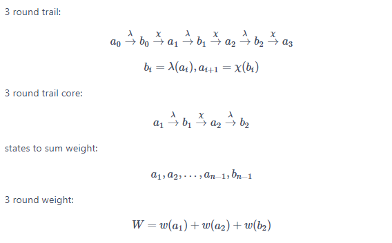

# Xoodoo SAT solver

**Using [CryptominiSAT](https://github.com/msoos/cryptominisat/) to find 3-round differential trails of [Xoodoo](https://keccak.team/xoodoo.html)**

## Install

**1. Install cryptominisat**

To build and install, first get the tar.gz package in [here](https://github.com/msoos/cryptominisat/releases), and issue(in Linux):


```
sudo apt-get install build-essential cmake
# not required but very useful
sudo apt-get install zlib1g-dev libboost-program-options-dev libm4ri-dev libsqlite3-dev help2man
tar xzvf cryptominisat-version.tar.gz
cd cryptominisat-version
mkdir build && cd build
cmake ..
make
sudo make install
sudo ldconfig
```

**2. Install pysat**

We use [pysat](https://github.com/pysathq/pysat) to generate the **cnf file** for cardinality constraint, which is used to bound the weight of the trail.
A cardinality constraint is a constraint of the form: $$\sum_{i=1}^n{x_i}\leq k, x_i={0,1}$$ Here n is the number of variables.

```
pip3 install python-sat
```

**3. Compile XOODOOSAT**

Just clone and run:

```
make
```

By default the output executable file is **xoodoo** defined in **Makefile**.

## Test

Run:

```
./xoodoo -h
Options:
 -r, --round round_num      How many rounds to trail (default 3).
 -w, --weight weight        The weight to bound for the trail (default 25).
 -t, --thread thread        The number of threads for the process (default 16).
 -m, --mode mode            The mode for weight sum (default 0), choices={0,1,2}, 0 for atmost, 1 for atleast, 2 for equals.
                            See pysat_card_AS.py for more information.
 -h, --help                 Help information.
```
Note that:
the weight in here is actually the number of active columns.  So after get the result of 3-round trails, we can replace the weight by the number of active columns.


You can see the optional parameters like round number(how many rounds to analysis), weight, etc.

Example:
```
# weight<=25, 3 rounds, 16 threads
./xoodoo -r 3 -w 25 -t 16 -m 0
# weight=25, 3 rounds, 16 threads
./xoodoo -r 3 -w 25 -t 16 -m 2
```
Hang in the background：  command--nohup and redefine an output file,for example:
nohup command > myout.file 2>&1 &
Note that:



Finally, the result is output in result folder.

## Results
we took about two month to find 122 differential and 123 linear trails, respectively. However, if we synchronously running weight=25 and weight<=25(actually in here,  the real weight is 50), we only need one months due to the order of solutions is different under different parameter setting.
```
./xoodoo -r 3 -w 25 -t 16 -m 0
./xoodoo -r 3 -w 25 -t 16 -m 2
```
